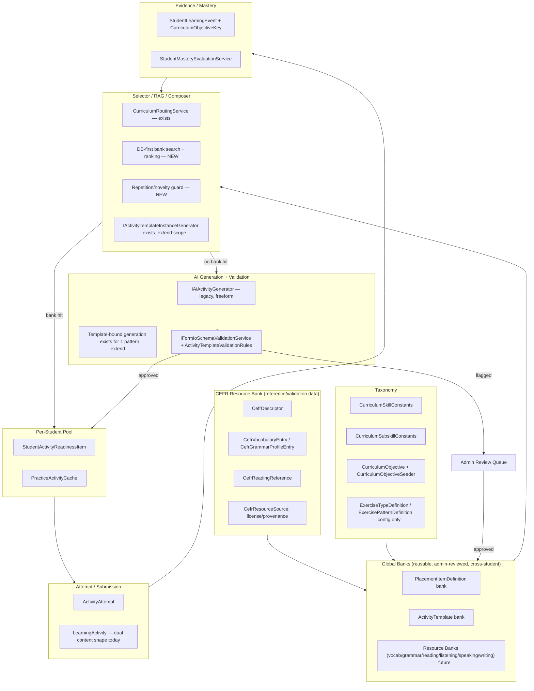

# Bank-First AI Teaching — Clean Target Architecture Plan

**Date:** 2026-07-08
**Related sprint/feature:** Long-term product direction alignment — extends and supersedes-in-part `docs/reviews/2026-07-07-ai-bank-assessment-architecture-plan.md`
**Type:** Planning / architecture alignment only — **no app code, migrations, or docs other than this file were changed**
**HEAD at start of review:** `de8426a1` (clean tree)
**HEAD at end of review:** `de8426a1` (unchanged — planning doc only)

**Files reviewed:** see per-section citations; primary sources were `docs/reviews/2026-07-07-ai-bank-assessment-architecture-plan.md`, `docs/architecture/README.md`, `LinguaCoach.Domain/Entities/{ActivityTemplate,LearningActivity,StudentActivityReadinessItem,PlacementItemDefinition,ExercisePatternDefinition,PracticeActivityCache,CurriculumObjective,StudentLearningEvent}.cs`, `LinguaCoach.Infrastructure/Jobs/{LessonBatchGenerationJob,ActivityMaterializationJob,PracticeGymGenerationJob,PracticeGymBufferRefillJob,TtsAudioGenerationJob}.cs`, `LinguaCoach.Infrastructure/Sessions/{SessionGeneratorService,DynamicPatternSelector}.cs`, `LinguaCoach.Infrastructure/Activity/AiActivityGeneratorHandler.cs`, `LinguaCoach.Web/src/app/app.routes.ts`, admin/student layout nav HTML files, `docs/architecture/*.md` frontmatter, `docs/sprints/current-sprint.md`, `docs/backlog/*.md`, `docs/roadmap/road-map.md`.

---

## 1. Executive summary

The bank-first direction the user is asking for is **already the direction the codebase moved in on 2026-07-07** (commit `ac68677d`, "Implement AI bank-first teaching architecture (Phases 1-10)"). That work built the missing piece — an `ActivityTemplate` bank, a CEFR resource-bank schema, a generation-validation pipeline, provenance fields on the readiness pool, calibration fields on the placement bank, an evidence-grouping fix, and a cross-entity admin review queue — entirely additively, with zero destructive changes and 3332 passing backend tests at the time.

However, that work landed in exactly **one narrow, feature-flagged pilot slice**: a single Practice Gym exercise pattern (`formio_practice_gym_pilot`), inert by default behind three independent safety gates. The other 27+ exercise patterns, and the entire **Today lesson** generation pipeline (`SessionGeneratorService` → `LessonBatchGenerationJob` → `ActivityMaterializationJob`), still run the old per-student, always-fresh, throwaway AI generation model with **zero** `ActivityTemplate` bank involvement. This is the single largest gap between current code and the target vision in the task prompt.

A second, independent gap is **documentation**: `docs/architecture/README.md` (the designated conflict-resolution root) is marked `status: current` but is dated `2026-06-10` — four weeks and one entire major architecture phase stale. It still lists the pre-bank activity-type list as "current," still calls "Practice Gym Expansion" the "next sprint" (it already shipped, twice), and its "Implementation State" table has no row for any 2026-07-07 work. `docs/sprints/current-sprint.md` and `docs/roadmap/road-map.md` are in a similar state — the roadmap did get touched for the 2026-07-06 Form.io migration and the 2026-07-08 QA bug-bash fix, but **not** for the 2026-07-07 bank-first phases, despite that being the largest single commit in this window. This directly means the durable "roadmap always updated" practice did not hold for this feature and needs a remediation pass, not just going forward but retroactively for this specific gap.

A third gap is **repetition/novelty**: nearly every piece of "dedup" scaffolding in the pipeline is either pattern-key-level only (not content-level) or actively inert — `PracticeActivityCache.ContentFingerprint` is literally salted with `Guid.NewGuid()` per row, so it can never collide, and its own doc comment overstates what it does. There is no content-level, cross-activity, or cross-student repetition avoidance anywhere in the codebase, and no embeddings/vector infrastructure exists at all (confirmed absent).

The good news, consistent with the 2026-07-07 plan's own conclusion: **none of this requires a rewrite.** The placement item bank, readiness pool lifecycle, mastery/evidence pipeline, and asset storage abstraction are already close to the target model. The work ahead is (a) generalizing the one proven pilot pattern to the rest of Practice Gym, (b) extending the same pattern to Today lesson generation — the biggest, riskiest, and most valuable piece of remaining work — (c) building real content-level repetition avoidance, (d) a documentation remediation pass, and (e) an admin/student navigation cleanup to remove the stale-naming and duplicate-route debt that has accumulated. Because the app is in development/UAT, destructive cleanup (deleting the legacy freeform generation path, renaming/removing confusing admin nav items, fixing duplicate routes) is explicitly in scope for later phases — but not this one, which is planning-only.

---

## 2. New product goal statement

SpeakPath is an AI teaching app that is **bank-first**: banked standards/templates/resources define what is correct and reusable; a selector/composer finds or personalizes the best existing bank item before ever asking AI to generate fresh content; AI generates new content only when the bank cannot satisfy the need, and that generation is always validated against the bank's own rules and reviewed for promotion back into the bank. AI remains central to teaching, composing, personalizing, evaluating, and explaining — but it is not an uncontrolled generator invoked fresh for every single student activity.

---

## 3. Current-state audit

### 3.1 What already shipped bank-first (2026-07-07, commit `ac68677d`)

Per `docs/reviews/2026-07-07-ai-bank-assessment-architecture-plan.md` (verified still true against current `HEAD`):

- **Subskill taxonomy** — `CurriculumSubskillConstants` (36 subskills), nullable `Subskill` column on `CurriculumObjective`, `PlacementItemDefinition`, `StudentLearningEvent`, `StudentActivityReadinessItem`.
- **CEFR Resource Bank (schema only)** — `CefrResourceSource`, `CefrDescriptor`, `CefrVocabularyEntry`, `CefrGrammarProfileEntry`, `CefrReadingReference`. Empty tables, no import, license-review doc exists (`docs/architecture/cefr-resource-licensing-review.md`).
- **`ActivityTemplate` bank** — full entity (`Domain/Entities/ActivityTemplate.cs`), admin CRUD stack (Application/Infrastructure/Api/Angular), reuses `IFormIoSchemaValidationService` for answer/scoring-leak protection.
- **AI generation validated against templates** — `IActivityTemplateInstanceGenerator`, `POST /api/admin/activity-templates/{id}/generate-preview`, validated via Form.io schema check + `ActivityTemplateValidationRules` (required keys, max length, forbidden words).
- **`StudentActivityReadinessItem` provenance** — `SourceTemplateId`, `SourceBankItemId`, Form.io schema/scoring snapshots, `PersonalizationReason`, `GeneratedByModel/Provider`, `ValidationStatus`.
- **`PlacementItemDefinition` calibration fields** — `DifficultyBand`, `EvidenceWeight` (recorded, **not yet consumed** by `PlacementAssessmentService`), `DiscriminationIndex`/`CalibrationSampleSize`, `ReviewStatus`, versioning fields (no "create next version" command yet).
- **`StudentLearningEvent.CurriculumObjectiveKey`** — closes the mastery-grouping proxy gap (`PatternKey` fallback retained for old events).
- **Admin review queue** — cross-entity (`ActivityTemplate` + `PlacementItemDefinition`), read-only triage list; explicitly excludes the separate `StudentActivityReadinessItem` review-scaffold pilot.
- **Form.io Practice Gym pilot** — one pattern (`formio_practice_gym_pilot`), triple-gated (feature flag off by default + `ImplementationStatus="planned"` + requires a published/approved template to exist), proves the full bank → AI-personalize → Form.io-render → deterministic-score chain end to end for exactly one pattern.

All of this was additive: no destructive migration, no removed entity, 3332 backend tests passing at the time.

### 3.2 What was NOT touched by that work (confirmed by this session's inspection)

**Today lesson pipeline — still fully old-model, zero bank involvement:**

- `SessionGeneratorService.GetOrCreateTodaysSessionAsync` (`Infrastructure/Sessions/SessionGeneratorService.cs:55-196`) — deterministic session/exercise-slot planning, zero `ActivityTemplate` references.
- `LessonBatchGenerationJob` (`Infrastructure/Jobs/LessonBatchGenerationJob.cs`) — AI batch-plans session/exercise structure (prompt `LessonBatchPlanKey`), zero `ActivityTemplate` references.
- `ActivityMaterializationJob` (`Infrastructure/Jobs/ActivityMaterializationJob.cs:186-212`) — **always** constructs a brand-new `LearningActivity` via `IAiActivityGenerator.GenerateActivityContentAsync`; never looks up or reuses existing content; zero `ActivityTemplate` references.
- `AiActivityGeneratorHandler` (`Infrastructure/Activity/AiActivityGeneratorHandler.cs:74-186`) — the actual AI call; output is `ModuleStageSchema`-shaped JSON (`schemaVersion`/`learnContent`/`practiceContent`/`feedbackPlan`), a **different contract** from `ActivityTemplate.FormIoBaseSchemaJson` (Form.io component-tree shape). `LearningActivity` had to grow a **second**, parallel field pair (`FormIoSchemaJson`/`ScoringRulesJson` via `SetFormIoContent`) specifically so the one pilot pattern could carry Form.io content side-by-side with the legacy field, rather than unifying the two — direct evidence the two shapes were judged too divergent to merge in one stroke.
- The only cross-call reuse anywhere in this pipeline is TTS **audio bytes** (`TtsAudioGenerationJob`, transcript+speaker-profile hash idempotency, scoped to a single `LearningActivityId`) — not lesson content.

**Practice Gym — bank involvement is one pattern out of the full catalog:**

- `PracticeGymGenerationJob.MaterializeAsync` (`Infrastructure/Jobs/PracticeGymGenerationJob.cs:111-279`) calls `IAiActivityGenerator.GenerateActivityContentAsync` (same legacy path as Today) for every pattern **except** the one gated pilot pattern, which alone queries `ActivityTemplates`.
- `PracticeGymBufferRefillJob` queues `PracticeActivityCache` rows per student × pattern with **no cross-student or cross-session reuse** — every row and every materialized `LearningActivity` is scoped to exactly one student.

**Repetition/novelty avoidance — partial and largely pattern-level, one component inert:**

- `DynamicPatternSelector` scores which exercise **pattern key** to pick next based on recent pattern history — pattern-level, not content-level.
- `LessonBatchGenerationJob.BuildCompactSummaryAsync` passes the last 8 session **topics** to the AI prompt as `avoidRepeating`/`coveredScenarios` — soft, prompt-level guidance with no verification the model complied, and no equivalent exists at the individual-activity-content level.
- `PracticeActivityCache.ContentFingerprint` — named and doc-commented as a "duplicate-prevention fingerprint," but is computed as `Sha256($"{studentProfileId}:{pattern}:{Guid.NewGuid():N}")` (`PracticeGymBufferRefillJob.cs:89`) — the fresh GUID guarantees it can never collide. It is never queried/compared anywhere in the codebase. This is dead/misleading code, not a working repetition guard.
- No content-similarity, cooldown, or cross-student dedup logic exists anywhere. No embeddings/vector infrastructure exists at all (`pgvector`, cosine similarity, vector columns — all absent, confirmed by exhaustive grep).

**`ExercisePatternDefinition` / `DynamicPatternSelector`** — confirmed to be a reusable **prompt/config** template only (`Key`, `PrimarySkill`, `AiGeneratePromptKey`, `InteractionMode`, `MarkingMode`, etc.) with **no content field at all** — matches the 2026-07-07 plan's characterization exactly; this is not a content bank and never has been.

### 3.3 Admin and student navigation (current, as of this session)

**Admin sidebar** (`design-system/admin/layouts/admin-app-layout/admin-app-layout.component.html:170-274`, mirrored in a separate mobile-drawer block lines 43-134 — duplicated markup):

- Overview → Dashboard
- Students → Students
- AI System → AI Config, AI Operations, Prompts, AI Usage, Usage Policies
- Analytics → Usage & Analytics
- Content → Lessons, Curriculum, Exercise Types, Onboarding, Placement items, **Activity templates**, **Review queue**
- System → Notifications, Integrations, Diagnostics, Security, Feature Gates

Notable issues found:
- Three separately named "usage" surfaces across two different sections (AI Usage, Usage Policies, Usage & Analytics) — consolidation candidate.
- The bank-first curation tooling (Placement items, Activity templates, Review queue) sits in "Content," while the AI-authoring-adjacent tooling (Prompts, AI Config) sits in a separate "AI System" section — this organizational split visually reinforces the old-vs-new mental-model boundary rather than resolving it.
- Dead route aliases with no nav entry: `admin/careers` → redirects to `curriculum` (`app.routes.ts:83-85`); `admin/ai-usage` → redirects to `usage` (`app.routes.ts:90-93`).

**Student sidebar** (`design-system/student/layouts/student-app-layout/student-app-layout.component.html:22-43`, mobile bottom nav duplicated lines 144-167): Today, Journey, Practice, Progress, Profile. No sidebar entry for Placement, Vocabulary, Speaking, or Assessment even though routes exist — reachable only via deep link/flow.

**Duplicate routes:** `/my-path` and `/journey` both load `JourneyComponent` (`app.routes.ts:206-213`) — dead duplicate.

### 3.4 Documentation staleness

- `docs/architecture/README.md` — marked `status: current`, `lastUpdated: 2026-06-10 22:00`. This is the conflict-resolution root per its own rules, yet: its "Current Product Direction" section lists the pre-bank activity-type list and calls "Practice Gym Expansion" the next sprint (already shipped twice since); its "Architecture Docs" table links to `curriculum-syllabus-model.md`, **a file that no longer exists** (broken link); its "Implementation State (as of 2026-06-10)" table has zero rows for any 2026-07-07 work and still marks "Practice Gym expansion" as `⬜ Deferred`. The table itself shows piecemeal edits up to 2026-07-03 rows without ever bumping the frontmatter date or the direction/state sections — internally inconsistent, not just stale.
- `docs/architecture/learning-activity-engine.md`, `practice-gym.md`, `course-session-learning-model.md` — all marked `current`, all predate 2026-07-07, all present the old always-fresh-AI-generation model as the sole current architecture with no forward pointer to the bank.
- `docs/architecture/readiness-pool.md` — closest to current (2026-07-02) but will go stale the moment the deferred Phase 6-equivalent work for Today/general Practice Gym lands; needs a forward-looking note now.
- `docs/sprints/current-sprint.md` — `lastUpdated: 2026-07-02`, does not reflect the 2026-07-06 Form.io migration or 2026-07-07 bank-first work at all.
- `docs/roadmap/road-map.md` — frontmatter says `2026-07-03` but its own Decision Log has entries as late as 2026-07-08 (bug-bash fix) and 2026-07-06 (Form.io migration) — so it **was** updated for those, but has **zero** mention of the entire 2026-07-07 bank-first phase (`ActivityTemplate`, CEFR resource bank, `CurriculumObjectiveKey`, review queue, Form.io pilot). This is a genuine break in the "roadmap always updated" practice, specifically for this feature, and should be corrected retroactively.
- No sprint doc exists for the 2026-07-07 work at all — the review doc is the only record.

---

## 4. What already matches the goal

- Placement Form.io item bank with backend-only scoring, answer-leak validation, adaptive selection (`PlacementAssessmentService`) — the strongest existing "bank" piece in the app.
- `ActivityTemplate` bank + admin CRUD + review/publish workflow — exists, proven with one live pilot pattern.
- Generation-validation pipeline (`IFormIoSchemaValidationService` reused for template schemas, `ActivityTemplateValidationRules` for required keys/length/forbidden words).
- `StudentActivityReadinessItem` lifecycle (`Queued → Generating → Ready → Reserved → Consumed`, branching to `Failed/Expired/Stale/ReviewOnly/Skipped`) plus `AdminReviewStatus` — already a superset of what a "per-student pool" needs; correctly not duplicated with a new entity.
- Object/asset storage abstraction (`IFileStorageService` + `AudioAsset`) — DB holds only object keys, never bytes; Form.io `speakingResponse` component proves the pattern end to end. No changes needed.
- Subskill taxonomy, curriculum objective/routing model, evidence (`StudentLearningEvent` + `CurriculumObjectiveKey`), mastery evaluation — all functioning and now correctly wired.
- CEFR resource bank schema + licensing-review discipline (no import without an approved `CefrResourceSource`).
- Cross-entity admin review queue pattern, reusable for future bank types.

---

## 5. What conflicts with the goal

| Item | Conflict | Severity |
|---|---|---|
| Today lesson pipeline (`SessionGeneratorService`→`LessonBatchGenerationJob`→`ActivityMaterializationJob`) | 100% per-student, always-fresh AI generation; zero bank involvement | **High** — this is the primary student-facing surface and the biggest structural gap |
| `PracticeGymGenerationJob` for all non-pilot patterns | Same legacy generation path, no bank lookup | **High** — same root cause as Today, ~27 of 28 patterns affected |
| `PracticeActivityCache.ContentFingerprint` | Salted with `Guid.NewGuid()`, can never collide, never queried — misleading dead code | Medium — actively misleads future readers into thinking dedup exists |
| Content-level repetition avoidance | Does not exist anywhere; only pattern-key and session-topic level guards exist, both soft/prompt-level | **High** — directly violates the "students must not see repetitive activities" requirement |
| `docs/architecture/README.md` | Stale conflict-resolution root, broken link, internally inconsistent | Medium — misleads any agent or engineer who trusts it as source of truth |
| `learning-activity-engine.md`, `practice-gym.md`, `course-session-learning-model.md` | Present old model as current with no bank pointer | Medium |
| `docs/roadmap/road-map.md`, `docs/sprints/current-sprint.md` | Missing the entire 2026-07-07 phase | Medium |
| Admin nav "AI System" vs "Content" split | Reinforces old-vs-new mental model rather than resolving it | Low-Medium |
| `admin/careers`, `admin/ai-usage` route aliases | Dead legacy names, no nav entry | Low |
| `/my-path` vs `/journey` duplicate route | Dead duplicate | Low |
| `EvidenceWeight` on `PlacementItemDefinition` | Recorded but not consumed by confidence calc | Low (already tracked as a known follow-up) |
| No "create next version" workflow for `ActivityTemplate`/`PlacementItemDefinition` | Versioning fields exist but dormant | Low (already tracked) |

Nothing above requires deleting a subsystem outright at this stage — the correct framing is "extend the proven pilot pattern to the rest of the surface," not "replace."

---

## 6. Target architecture

Assets: `IFileStorageService` + `AssetType` entities — unchanged, already correct.
Admin: reuse `AdminReviewStatus` pattern for every new bank type — unchanged, already correct.

---

## 7. Bank taxonomy

| Layer | Purpose | Entity(ies) | Status |
|---|---|---|---|
| CEFR Resource Bank | Ingredients — validate/constrain generation | `CefrDescriptor`, `CefrVocabularyEntry`, `CefrGrammarProfileEntry`, `CefrReadingReference`, `CefrResourceSource` | Schema exists, empty, no import (license gate) |
| Skill/Subskill taxonomy | Classification | `CurriculumSkillConstants`, `CurriculumSubskillConstants` | Exists |
| Curriculum Objective Bank | What to teach | `CurriculumObjective` | Exists (A1–B2 only) |
| Exercise Type/Pattern Bank | How to render/score/prompt | `ExerciseTypeDefinition`, `ExercisePatternDefinition` | Exists — config only, correctly not a content bank |
| Placement Item Bank | Recipes for assessment | `PlacementItemDefinition` | Exists, most mature bank in the app |
| Activity Template Bank | Recipes for lesson/practice content | `ActivityTemplate` | Exists, 1 live consumer pattern |
| Resource Banks (vocab/grammar/reading/listening/speaking/writing) | Reusable raw content | none yet — future work, deferred beyond this plan's roadmap horizon | Not started |
| Per-Student Readiness Pool | Assigned/personalized instances | `StudentActivityReadinessItem`, `PracticeActivityCache` | Exists; provenance fields exist but only populated by the pilot pattern |
| Attempt/Submission | Runtime student work | `ActivityAttempt`, `LearningActivity` (dual content shape) | Exists |
| Evidence/Mastery | Learning brain | `StudentLearningEvent` + `CurriculumObjectiveKey`, `StudentMasteryEvaluationService` | Exists, grouping fixed |

---

## 8. AI responsibility vs bank responsibility

Unchanged from the 2026-07-07 plan's boundary table — it is correct and should be the standing rule as the pattern generalizes:

| Layer | Responsibility |
|---|---|
| AI | Draft instances from a template; personalize wording/scenario; explain mistakes; generate hints/feedback; generate asset *prompts* (not final validated schema); compose Today from banked modules once that surface migrates |
| Bank | Approved templates/patterns, skill/subskill/CEFR/objective metadata, scoring model shape, reviewed reusable content, calibration/quality anchors |
| Backend | Validate every AI output against bank rules, split student-visible vs scoring-only content, select via routing + selector, score deterministically, update evidence/mastery, manage assets |

The one addition this plan makes: **AI must not be allowed to generate content when a suitable bank item already exists and passes the selector's ranking threshold** — this is a new hard rule the current freeform pipeline does not enforce anywhere (it always generates, never looks up first).

---

## 9. RAG / search / repetition strategy

### 9.1 Selector (DB-first, no embeddings yet)

Hard filters (all must pass): CEFR level, skill, subskill, curriculum objective, context/focus tags, duration budget, `IsPublished && ReviewStatus == Approved`, not in the student's recent-use cooldown window.

Ranking (soft, scored): match strength (tag overlap), student weakness signal (from `StudentMasteryEvaluationService`/routing), performance history on this template for this student's cohort, quality/review score, novelty (inverse recency), remediation/review need.

### 9.2 Repetition/novelty — concrete plan (nothing like this exists today)

New fields/entities needed:
- `StudentActivityUsageLog` (or extend `StudentActivityReadinessItem`/`LearningActivity` with `SourceTemplateId` + `ConsumedAtUtc`, already partially present) — a queryable per-student history of `(TemplateId | SourceBankItemId, ContentFingerprint, ConsumedAtUtc)`.
- A **real** content fingerprint — hash of the actual generated/selected content (topic + scenario + key phrases), replacing the current dead `PracticeActivityCache.ContentFingerprint` (which must be fixed or removed — see §13).
- Cooldown window (config per skill/pattern, e.g. "no same template within N days or M activities").
- Explicit `PersonalizationReason`/`RoutingReason`-style tag for intentional review/remediation repeats, so cooldown logic can distinguish "accidental repeat" from "deliberate spaced-review repeat."
- Future (not this phase): embedding-based near-duplicate detection once/if a vector column or extension is introduced — explicitly deferred, no infra exists today.

### 9.3 AI fallback hierarchy (target, to formalize in code)

1. Exact approved bank template/item already matching filters and outside cooldown.
2. Similar approved bank item (lower ranking score, still above threshold).
3. Bank template + AI light personalization (today's pilot pattern's exact behavior).
4. Bank template + AI-generated content variant.
5. AI creates a new candidate from template (no suitable existing instance).
6. Candidate validated (`IFormIoSchemaValidationService` + `ActivityTemplateValidationRules`, extended with a repetition/novelty check).
7. Auto-approve if low-risk (matches template exactly, passes all checks) or route to review queue.
8. Store for future reuse regardless of path taken.
9. Student receives only after validation/approval gate passes.

---

## 10. Final module shape recommendation

Confirmed from the 2026-07-07 plan and validated again this session: **one Form.io schema per module stage** (Learn / Practice / Feedback as separate schemas), not one schema per whole module and not one giant Today wizard. This matches the existing `LearnContentDto`/`PracticeContentDto`/`FeedbackPlanDto` partition already used by `ModuleStageSchema`.

The concrete blocker to adopting this for Today/general Practice Gym is the shape mismatch confirmed this session: `ActivityTemplate.FormIoBaseSchemaJson` (Form.io) vs `LearningActivity.AiGeneratedContentJson` (`ModuleStageSchema`) are different contracts, and `LearningActivity` already had to grow a second parallel field pair to let one pattern use Form.io. The clean target is **not** to keep growing parallel fields per pattern — it is to make `ActivityTemplate`'s stage schemas the single content contract, and have the legacy `ModuleStageSchema`/`AiGeneratedContentJson` path deprecated pattern-by-pattern as each pattern gets Form.io-shaped templates + a compatible renderer/evaluator. Today should orchestrate modules (Learn/Practice/Feedback per module, multiple modules per Today session); Form.io renders each stage's body, not the whole session.

---

## 11. Admin UI/menu target

Recommended changes to the current nav (§3.3):

- **Rename** "AI System" → keep for genuinely freeform config (AI Config, AI Operations, Prompts) but move it visually *adjacent to* Content, not separated by "Analytics" — signal that these feed the same pipeline rather than being a parallel system.
- **Consolidate** the three "usage" surfaces (AI Usage, Usage Policies, Usage & Analytics) into one "Usage & Cost" section with sub-tabs, or clearly differentiate labels (e.g. "Token Usage", "Governance Policies", "Adoption Analytics") — current names are too similar and don't communicate scope difference.
- **Keep** Content section grouping (Lessons, Curriculum, Exercise Types, Onboarding, Placement items, Activity templates, Review queue) — this is already the correct bank-first grouping; just needs the AI-authoring tools nearby.
- **Remove** dead aliases: `admin/careers`, `admin/ai-usage` (redirect targets with no nav entry) — either give them real nav entries if still meaningful, or delete the routes entirely in a later cleanup phase.
- **Add**, once built: "Resource Banks" (vocabulary/grammar/reading/listening/speaking/writing) as its own Content sub-section, and a CEFR Resource Bank admin page (currently the schema has no admin UI at all).

---

## 12. Student UI impact

Student sidebar stays simple (Today, Journey, Practice, Progress, Profile) — no change recommended, this already matches the "student should not see bank complexity" requirement. Two cleanup items only:
- Fix the `/my-path` vs `/journey` duplicate route (§3.3) — dead code, delete the duplicate.
- Consider whether Assessment/Speaking/Placement need discoverable nav entries or are intentionally deep-link-only (flag for product decision, not an architecture defect).

As the bank-first Today/Practice migration proceeds pattern-by-pattern, the student sees no difference in flow — same Learn/Practice/Feedback stages, same submission UX — only the underlying content source changes from always-fresh-AI to bank-first-with-AI-personalization.

---

## 13. Backend cleanup/deletion candidates

| Item | Recommendation | Reasoning |
|---|---|---|
| `PracticeActivityCache.ContentFingerprint` (current `Sha256(...:{Guid.NewGuid():N})` computation) | **Fix or delete** | Actively misleading — named/documented as dedup, functionally inert. Fix by hashing actual content signal once real repetition avoidance (§9.2) lands; if not fixed promptly, delete the field/column rather than leave dead-but-plausible-looking code. |
| `admin/careers`, `admin/ai-usage` route redirects | **Delete** (backend has no equivalent, this is frontend-only, listed here for cross-reference) | Dead aliases, no nav entry, no external link depends on them (development/UAT — verify via analytics/logs before deleting if any doubt) |
| Legacy freeform `IAiActivityGenerator` path for a given pattern | **Deferred deletion, pattern-by-pattern** | Delete only after that pattern has an approved `ActivityTemplate` + compatible renderer/evaluator — do not delete broadly now; this is the multi-phase migration (§17), not a one-shot removal |
| `PlacementItemDefinition.EvidenceWeight` (currently inert) | **Wire up, don't delete** | Already flagged as a real follow-up in the 07-07 plan; either consume it in `PlacementAssessmentService`'s confidence calc or remove the field — don't leave it recorded-but-ignored indefinitely |
| Duplicate mobile-drawer nav markup (admin + student) | **Merge/DRY in a later frontend refactor** | Not urgent, but flagged since it's real duplicated markup that will drift |

Nothing in the backend qualifies for *immediate* destructive deletion in this phase — the correct move is fixing the misleading fingerprint and wiring the inert `EvidenceWeight`, with the freeform generator path retired incrementally as each pattern migrates.

---

## 14. Frontend cleanup/deletion candidates

| Item | Recommendation |
|---|---|
| `/my-path` route (duplicate of `/journey`) | **Delete** the duplicate route definition; keep `/journey` as canonical (matches sidebar label) |
| `admin/careers`, `admin/ai-usage` redirect routes | **Delete** once confirmed unused externally |
| Admin nav "AI System" vs "Content" separation | **Restructure**, not delete — see §11 |
| Three overlapping "usage" nav labels | **Consolidate/rename** — see §11 |

---

## 15. Documentation cleanup plan

| Doc | Action |
|---|---|
| `docs/architecture/README.md` | **Update now** (separate task from this plan, or as an immediate follow-up) — refresh "Current Product Direction," "Implementation State" table, add rows for all 2026-07-07 bank-first artifacts, fix the broken `curriculum-syllabus-model.md` link, bump `lastUpdated` |
| `docs/architecture/learning-activity-engine.md`, `practice-gym.md`, `course-session-learning-model.md` | **Update** with a bank-first-alignment note pointing to the `ActivityTemplate` bank and the pilot pattern; do not mark historical, they're still substantially accurate for the legacy path that remains dominant |
| `docs/architecture/readiness-pool.md` | **Add forward-looking note** — will need an update the moment general Today/Practice-Gym provenance wiring lands |
| `docs/sprints/current-sprint.md` | **Replace** with a new entry reflecting bank-first Phases 1-10 as the last completed sprint, and this plan's Phase A (§17) as next |
| `docs/roadmap/road-map.md` | **Add retroactive Decision Log entry** for the 2026-07-07 bank-first phase — this is a real gap in the "always updated" practice and should be corrected now, not just going forward |
| `docs/reviews/2026-07-07-ai-bank-assessment-architecture-plan.md` | **Keep as-is**, link this new doc from it (add a "superseded/extended by" pointer) |

Because this app is in development, no doc needs to be preserved "for history" beyond what's already marked historical — but nothing here needs deletion either; these are updates, not replacements.

---

## 16. Destructive migration/cleanup strategy for UAT

Nothing in this plan requires destructive action in the current phase (planning only). For future phases, the following destructive actions are pre-approved in principle (per the user's explicit development/UAT framing) but should each get their own confirmation at execution time:

- Delete `PracticeActivityCache.ContentFingerprint` column if not fixed within one phase of being flagged.
- Delete `admin/careers` and `admin/ai-usage` route redirects once confirmed unused.
- Delete the legacy `ModuleStageSchema`/`AiGeneratedContentJson` generation path **per pattern**, only after that pattern's `ActivityTemplate`-based replacement is live and validated in production for at least one full student cohort cycle — never delete the fallback before the replacement is proven.
- Delete the duplicate `/my-path` route.

No table drops, no entity removals, no test deletions are recommended in this plan — everything flagged above is small, additive-reversal cleanup, not a rewrite.

---

## 17. Phased roadmap

| Phase | Goal | Destructive? | Backend | Frontend | Docs | Risk | Acceptance |
|---|---|---|---|---|---|---|---|
| **A — Doc/nav remediation** | Fix stale README, roadmap, sprint doc; fix dead routes/fingerprint | No | Delete dead `Guid.NewGuid()` fingerprint salt or wire real hash; delete dead route aliases | Delete `/my-path` dup route; nav label cleanup | Update README/roadmap/current-sprint | Low | README/roadmap/sprint reflect 2026-07-07+08 state; no dead routes remain |
| **B — Repetition/novelty foundation** | Real content-level dedup | No (additive) | New usage-log query, real `ContentFingerprint` computation, cooldown config, wire into `PracticeGymGenerationJob` + `LessonBatchGenerationJob` | none | New `docs/architecture/repetition-and-novelty.md` | Medium | Students provably don't see same-template repeats within cooldown window in tests |
| **C — Generalize Form.io pilot to remaining Practice Gym patterns** | Extend the proven `TryMaterializeFromTemplateAsync` pattern to more exercise patterns, one at a time | No | Author + approve templates per pattern; extend renderer/evaluator support pattern-by-pattern | Renderer already supports Form.io; verify per pattern | Update `practice-gym.md` | Medium | Each migrated pattern has a template bank hit rate tracked and legacy fallback still present |
| **D — Today lesson composer (bank-first)** | Point `ActivityMaterializationJob` at bank-first selector before falling back to AI | No (additive fallback preserved) | Selector service (§9.3), wire into `ActivityMaterializationJob`, template authoring for common Today patterns | none required initially | Update `learning-activity-engine.md`, `course-session-learning-model.md` | High — biggest surface, highest blast radius | Today lessons compose from bank templates for covered patterns; legacy generation remains fallback for uncovered patterns |
| **E — Resource Banks (vocab/grammar/reading/etc.)** | First slice of actual reusable raw content | No | New entities per resource type, admin CRUD | Admin pages | New architecture docs | Medium | At least one resource type (e.g. reading passages) populated and consumable by templates |
| **F — Legacy path retirement (per pattern)** | Remove `IAiActivityGenerator` freeform path for fully-migrated patterns | **Yes, per pattern, after proof** | Delete legacy generation call for that pattern only | none | Update docs to remove legacy references for retired patterns | Medium | No regressions after one full cohort cycle on the replacement path |
| **G — Admin nav/menu restructuring** | Consolidate usage sections, reposition AI-authoring tools next to Content | No | none | Nav restructure | Update `admin-ui-design-system.md` | Low | Nav review with product owner sign-off |

Phases A and B can start immediately and in parallel. Phase C should not start until B has at least a basic cooldown mechanism (otherwise more patterns just replicate the repetition problem at larger scale). Phase D is the highest-value, highest-risk phase and should not start until C has validated the migration pattern on at least 2-3 Practice Gym patterns.

---

## 18. Recommended next implementation prompt

Start with **Phase A** — it is the smallest, purely additive, unblocks nothing risky, and directly fixes the two things this session found most concretely broken (misleading dead fingerprint code, stale doc root). Suggested next-session prompt:

> "Implement Phase A from docs/reviews/2026-07-08-bank-first-ai-teaching-clean-architecture-plan.md: (1) update docs/architecture/README.md's Current Product Direction, Architecture Docs table (fix the broken curriculum-syllabus-model.md link), and Implementation State table to reflect the 2026-07-07 bank-first work and current date; (2) add a retroactive Decision Log entry to docs/roadmap/road-map.md for the 2026-07-07 bank-first phase; (3) replace docs/sprints/current-sprint.md's active-sprint section with the bank-first phase as last-completed and Phase A/B of the new plan as next; (4) fix PracticeActivityCache's ContentFingerprint computation in PracticeGymBufferRefillJob.cs so it hashes actual content-identifying data instead of a fresh Guid (or, if that's non-trivial this session, remove the field and its unique index rather than leave it misleadingly named); (5) delete the dead /my-path duplicate route and the admin/careers and admin/ai-usage redirect aliases from app.routes.ts after confirming nothing external depends on them. Run full backend + frontend test suites after each change."

---

## Documentation impact

- Docs reviewed: `docs/reviews/2026-07-07-ai-bank-assessment-architecture-plan.md`, `docs/architecture/README.md`, `docs/architecture/{learning-activity-engine,practice-gym,course-session-learning-model,readiness-pool,curriculum-routing,cefr-resource-licensing-review}.md`, `docs/sprints/current-sprint.md`, `docs/backlog/*.md`, `docs/roadmap/road-map.md`
- Docs updated: this new file only (`docs/reviews/2026-07-08-bank-first-ai-teaching-clean-architecture-plan.md`)
- Docs intentionally not updated: `docs/architecture/README.md`, `docs/roadmap/road-map.md`, `docs/sprints/current-sprint.md` (all flagged stale in §3.4/§15 but their remediation is Phase A of the roadmap this doc produces, not part of this planning deliverable itself)
- Reason: this is a planning-only deliverable per task instructions; no code, schema, or product behavior changed, and doc remediation is explicitly sequenced as the first implementation phase rather than folded into the plan itself

## AskUserQuestion decisions

None were required this session — the task was fully scoped by the provided prompt and existing repo state was sufficient to answer all planning questions without user clarification.

## Implementation tasks produced

See §17 (phased roadmap) — Phase A tasks are itemized in §18's recommended next prompt.

## Risks or unresolved questions

- Whether Resource Banks (vocab/grammar/reading/listening/speaking/writing as reusable content, §7) should be modeled as one polymorphic `ResourceBankItem` entity or separate per-skill entities — deferred to Phase E, not resolved here.
- Whether `ActivityTemplate` should eventually absorb `PlacementItemDefinition` into one unified bank entity, or remain a deliberately separate but structurally parallel bank — the 07-07 plan chose "parallel, not unified," and this plan does not revisit that decision; flagging it as a question worth a deliberate product/architecture decision if the two banks' schemas keep diverging.
- CEFR-J/UniversalCEFR licensing still unresolved (carried over from 07-07 plan, unchanged).
- Today lesson composer migration (Phase D) is the single highest-risk item in this roadmap and will likely need its own dedicated planning pass before implementation, given its blast radius across the primary student-facing surface.

## Final verdict

The bank-first direction is already correctly underway and architecturally sound; this plan's job was to find what the 2026-07-07 phase didn't cover, and it found three concrete, addressable gaps: (1) the Today lesson pipeline and most of Practice Gym still run 100% legacy freeform generation with zero bank involvement, (2) real content-level repetition avoidance does not exist anywhere and one piece of code (`PracticeActivityCache.ContentFingerprint`) actively misrepresents that it does, and (3) core documentation (architecture README, roadmap, current-sprint) fell out of sync with the 2026-07-07 work despite the project's own "always keep docs/roadmap updated" practice. None of these require destructive rework — all three are additive-first with clearly scoped, optional, later destructive cleanup once replacements are proven.

## Next recommended action

Start Phase A (§18) — documentation/roadmap remediation plus the two small, low-risk code fixes (dead fingerprint, dead routes). This is intentionally the smallest possible next step and does not commit to the larger Today-lesson migration (Phase D) until Phases B and C have proven the pattern at smaller scale.
